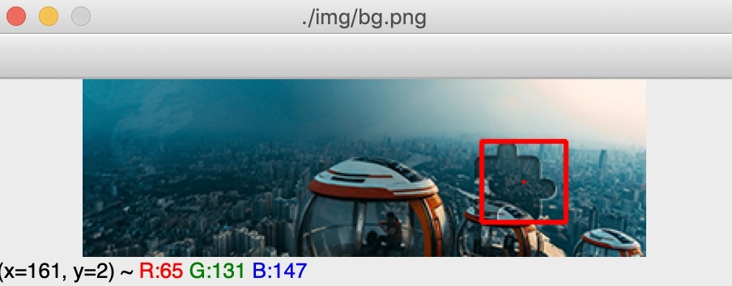

# 滑块缺口识别

## 战绩

准确度：没测试过

## 接口说明

### 1. 请求滑块缺口中心点

**请求方式：** GET(**HTTP**)

**请求地址：** http://127.0.0.1:5001/slider/get_gap_center_point

**请求包体：** 

    {
        "bg": "xxx",
        "slider": "xxx",
        "show": 1
    }
    
**请求示例**

http://127.0.0.1:5001/slider/get_gap_center_point?bg=https%3A%2F%2Fstatic.datayes.com%2Fslide%2F1ff5a31d677ba39ccdd9b5d8abe5873.png&slider=https%3A%2F%2Fstatic.datayes.com%2Fslide%2F613a2afcbd53a7cfff29ef3aadf2ef3f.png&show=1

或者使用本地图片

http://127.0.0.1:5001/slider/get_gap_center_point?bg=img%2Fbg.png&slider=img%2Fslider.png&show=0

**参数说明：**

| 参数 | 必须 | 说明 |
|:----|:---- |:-----|
|bg|是|背景缺口图网络地址或者本地路径|
|slider|是|小滑块网络地址或者本地路径|
|show|否|是否显示识别后的位置，即战绩里边的图片|

**返回结果：**

    {
        "code":200,
        "data":{
            "center_point": [75, 66]
        }
        "msg":"请求成功"
    }

**参数说明：**

| 参数 | 说明 |
|:----|:-----|
|code|返回码 （200 为成功， 非200出错）|
|data|返回的数据体|
|center_point|缺口滑块的中心点 [x,y]|
|msg|对返回码的文本描述内容|